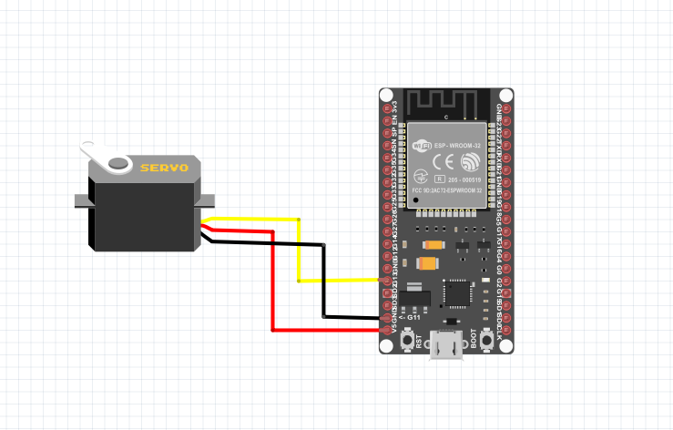

# Alimentador de Perros 

A continuacion se hace un reprote de los materiales, las librerias y el desarrollo sobre el alimentador de mascotas a travez de un bot mediante una conexion a internet

### Materiales

- 1 x ESP-WROOM-32 Dev Module
- 1 x Micro USB Cable
- 3 x Jumper Wires
- 1 x Servo Motor
- 1 x Base

### Herramientas de Telegram

- Botfather
- IDBot

### Librerias

- Libreria para hacer la conexion con Tlegram: https://github.com/witnessmenow/Universal-Arduino-Telegram-Bot
- ESP32Servo
- WiFi
- ArduinoJson

### Diagrama




### ESP32 Código 

```C++

#include <WiFi.h>
#include <WiFiClientSecure.h>
#include <ESP32Servo.h>
#include <analogWrite.h>
#include <ESP32Tone.h>
#include <ESP32PWM.h>

#include <UniversalTelegramBot.h>
#include <ArduinoJson.h>


Servo myservo;

static const int servoPin = 18;

// Reemplazar con tus credenciales de Wifi
const char* ssid     = "Nombre";
const char* password = "Contrasena";

// Inicializa Bot Telegram
#define BOTtoken "Bot Token"  // Tu Bot Token (Obtener de Botfather)

#define CHAT_ID "ID" // Tu ID de Telegram (Obtener de IDBot)

WiFiClientSecure client;

UniversalTelegramBot bot(BOTtoken, client);

void handleNewMessages(int numNewMessages) {

  for (int i=0; i<numNewMessages; i++) {
    // Chat id of the requester
    String chat_id = String(bot.messages[i].chat_id);
    if (chat_id != CHAT_ID){
      bot.sendMessage(chat_id, "Usuario no autorizado", "");
      continue;
    }

    String text = bot.messages[i].text;

    if (text == "/comida") {
      bot.sendMessage(chat_id, "Alimentando", "");
      myservo.write(180);             
      delay(900);                       
      myservo.write(0);              
    }
  }
}

void setup() {
  Serial.begin(9600);

  myservo.attach(servoPin);  // vincula el servo en el servoPin

  // Conecta a red WiFi con SSID y password
  Serial.print("Conectado a ");
  Serial.println(ssid);
  WiFi.begin(ssid, password);
  client.setCACert(TELEGRAM_CERTIFICATE_ROOT);
  
  while (WiFi.status() != WL_CONNECTED) {
    delay(500);
    Serial.print(".");
  }
  // Muestra IP local 
  Serial.println("");
  Serial.println("WiFi conectado.");
  Serial.println("IP address: ");
  Serial.println(WiFi.localIP());

  bot.sendMessage(CHAT_ID, "Bot iniciado", "");
}

void loop() {
  int numNewMessages = bot.getUpdates(bot.last_message_received + 1);

  while(numNewMessages) {
    handleNewMessages(numNewMessages);
    numNewMessages = bot.getUpdates(bot.last_message_received + 1);
  }
}